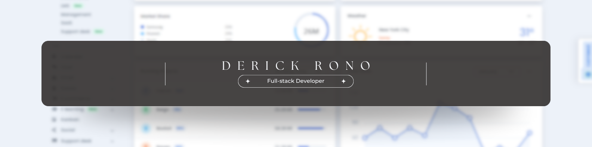

<!-- Banner Image -->

  

<h1 align="center">Hi 👋, I'm Derick Rono</h1>
<h3 align="center">Software Engineering Student at Multimedia University of Kenya</h3>

---

- 🌱 I’m currently learning **Full-stack Development with Node.js & Express**
- 👨‍💻 Check out my portfolio: [derickronoweb.vercel.app](https://derickronoweb.vercel.app)
- 💬 Ask me about **React, Tailwind CSS, and Frontend Development**
- 📫 Reach me at: **codedbyteofficial@gmail.com**

---

### 🌐 Connect with Me

  
  
  

---

### 🛠️ Languages & Tools

  
  
  
  
  
  
  
  
  

